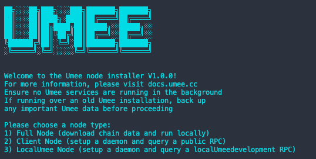

# Install UMEE



Simple installer with the following features:

- Installs dependencies
- Creates swap file (if needed)
- Joins testnet or mainnet
- Initializes/installs statesync or snapshot
- Creates cosmovisor or umeed background services

#### To install umeed, run the following in your terminal, then follow the on-screen instructions.

Download repo and use command: `python3 install.py`

```bash
python3 install.py
```

Note: on successful completion, this installer deletes itself to reduce accidental overwriting.

[This is a fork of the awesome works from Osmosis Labs](https://github.com/osmosis-labs/osmosis-installer/)
